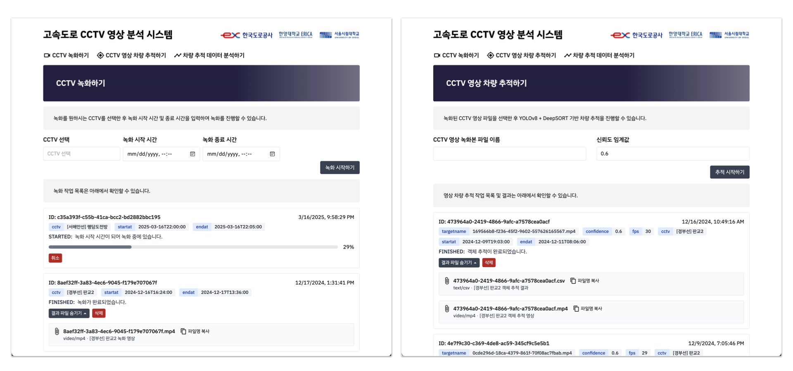
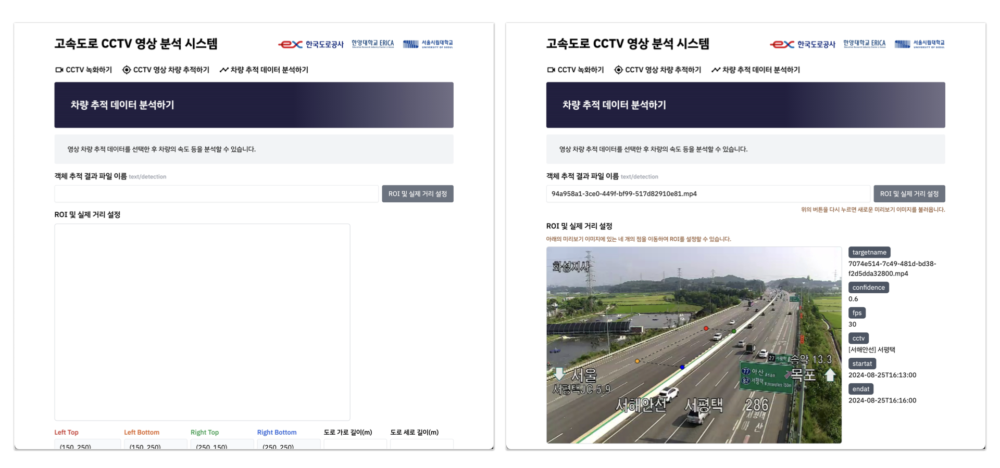

# Road CCTV Recorder/Analyzer

## 개요
본 시스템은 고속도로 CCTV 영상을 녹화하고 차량의 위치를 분석하여 교통 데이터를 수집할 수 있는 시스템입니다. 고속도로 CCTV HSL 영상은 ITS 국가교통정보센터로부터 가져오며, 차량 위치 분석은 YOLOv8 + DeepSORT 모델을 이용하여 수행합니다.

## 주요 기능

### **CCTV 녹화하기**
1. 녹화를 원하는 CCTV 구간과 녹화 시작/종료 시간을 설정합니다.
2. 녹화를 시작하면 아래의 녹화 작업 목록에 추가되며, 녹화 상태(PENDING, STARTED, FINISHED 등)를 확인할 수 있습니다.
3. 녹화가 완료되면 영상을 재생/다운로드 할 수 있습니다.

### **CCTV 영상 차량 추적하기**
1. 녹화가 완료된 CCTV 영상을 선택한 후, 차량 추적하기 버튼을 누르면 작업 목록에 추가됩니다.
2. 차량 추적 작업이 완료되면, 바운딩 박스가 그려진 영상과 추적된 차량 정보를 csv 파일로 다운로드할 수 있습니다.

### **차량 추적 데이터 분석하기**

1. 차량 추적이 완료된 데이터를 선택한 후, CCTV 영상의 특징점 및 도로 특성(폭, 길이 등)을 설정합니다.
    - 웹 인터페이스를 통해 CCTV 영상의 일부를 표시하고, 특징점 4개를 드래그 앤 드롭하여 설정합니다.
2. Perspective Transform을 이용하여 화면 상의 차량 위치를 도로 상의 위치로 변환된 데이터를 확인할 수 있습니다.


## 프로젝트 구조
```
.
├── cctv_recanalyzer/     # Python Backend
│   ├── core/             # 핵심 비즈니스 로직
│   ├── srv/              # 서비스 구현체
│   ├── repo/             # 데이터 저장소 구현체
│   ├── test/             # 테스트 코드
│   └── main.py           # 의존성 주입 및 서버 엔트리포인트 진입점
├── webui/                # React Frontend
│   └── src/              # 프론트엔드 소스코드
│       ├── assets/       # 이미지, 폰트 등
│       ├── client/       # OpenAPI 클라이언트
│       ├── components/   # React Hook 및 View 컴포넌트
│       ├── models/       # 타입스크립트 모델
│       └── routes/       # React Router 라우트 페이지
└── deploy/               # 배포 관련 설정
```

## 실행 방법
### 사전 준비
- Docker 또는 그에 준하는 컨테이너 환경
- CUDA 환경 준비: NVIDIA Container Toolkit [링크](https://docs.nvidia.com/datacenter/cloud-native/container-toolkit/latest/install-guide.html)
- vscode + devcontainer extension
- ITS 국가교통정보센터 API Key [링크](https://its.go.kr/opendata/)
- YOLOv8 모델 파일 [링크](https://huggingface.co/Ultralytics/YOLOv8/blob/main/yolov8l.pt)

### 개발
1. vscode에서 devcontainer로 진입합니다.
    - 명령 팔레트에서 `>Dev Containers: Open Folder in Container...` 실행
1. cctv_recanalyzer/ 디렉터리에서
    1. `pip install -r requirements.txt` 명령어를 실행하여 의존성을 설치합니다.
    1. `.env.example` 파일을 참고하여 `.env` 파일을 생성합니다.
    1. `fastapi dev` 명령어를 실행하여 서버를 실행합니다.
1. webui/ 디렉터리에서
    1. `npm install` 명령어를 실행하여 의존성을 설치합니다.
    1. `.env.example` 파일을 참고하여 `.env` 파일을 생성합니다.
    1. `npm run dev` 명령어를 실행하여 웹 서버를 실행합니다.

### 배포
1. cctv_recanaizer/.env.example 파일을 참고하여 cctv_recanaizer/.env 파일을 생성합니다.
1. webui/.env.example 파일을 참고하여 webui/.env 파일을 생성합니다.
1. deploy 디렉터리에서 `docker-compose up -d` 명령어를 실행합니다.